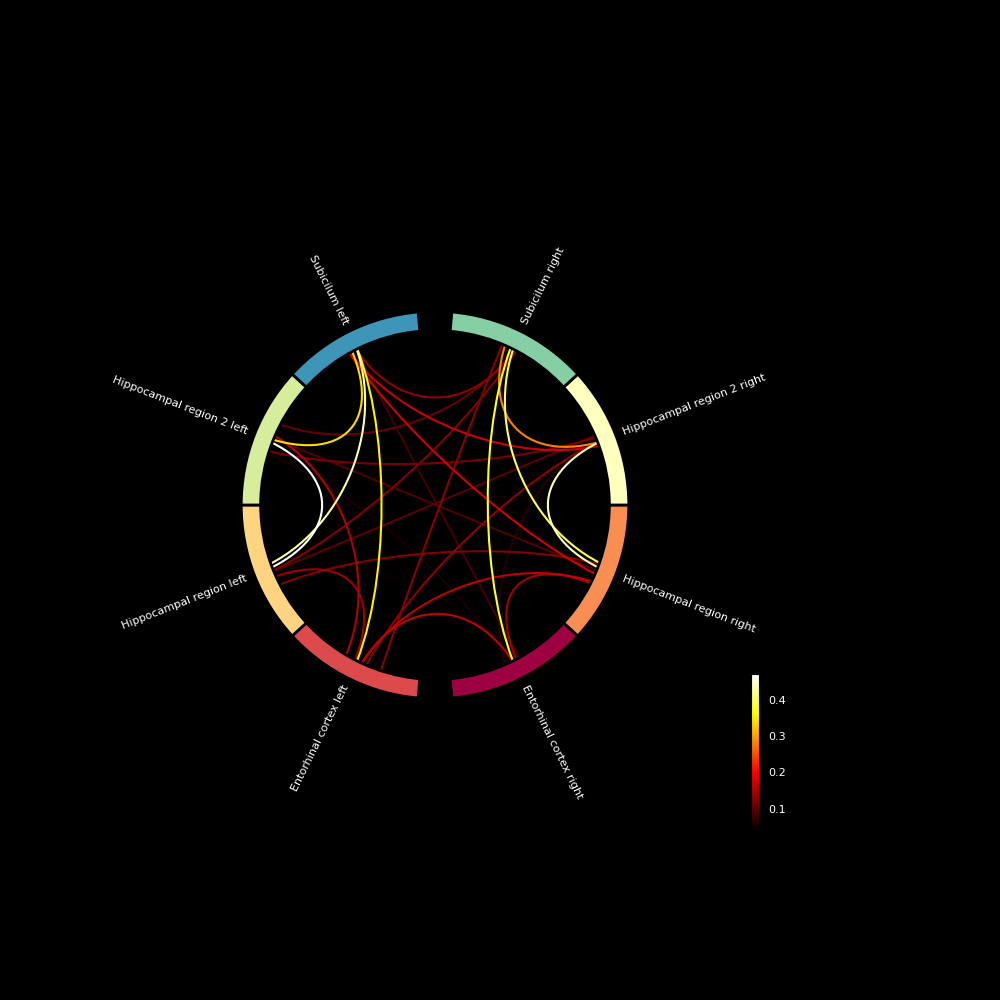
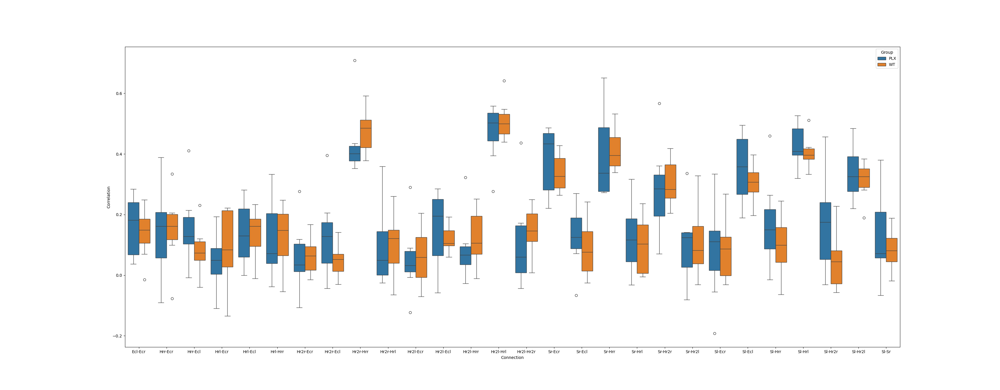

# ROI analysis

---

## Purpose : 
This directory is made to analyse functional connectivity in fMRI images between specific ROI.
* Images used as input are from RABIES confound correction or analysis. 
* Possibility to aggregate ROIs in order to treat the connectivity between groups of ROIs instead of ROI to ROI that is done in Rabies FC_matrix.
* Later, possibility to perform statistics on different subjects or aggregate the results of all subjects to get a connectogram.

# aggregate_FC.py : 

---

## Requirements : 

files needed : 

* aggregate_FC.py
* aggregate_utils.py
* ROI_autism.xlsx
* DSURQE_40micron_labels.nii

Libraries required : 

* python
* nibabel
* numpy
* matplotlib
* pandas

## Running the aggregate_FC.py : 

Example of command in a terminal : 

__python aggregate_FC.py --ROI_path "ROI_autism.xlsx" --atlas_path "DSURQE_40micron_labels.nii" --confound_path "confound" --output_path "output" --agg_LR False --sub_list "subject_list.txt"__

agg_LR arguments allows to aggregate left and right ROIs or to analyse them separately

Make sure you point to the adress of a "confound" directory obtained from RABIES
Make sure you have an atlas in nifti format
Make sure you have an excel sheet (example __ROI_autism.xlsx__) where : 
* There are only ROIs you are interested in
* There are columns "right label" and "left label" which contain labels corresponding to the input atlas
* There is a "hierarchy" column containing a specific name for each group of ROI you want to aggregate
If you only want to process a subset of subjects, make sure you have a __subject_list.txt__ containing the names of confound nifti files, one for each row of the .txt file. (Example given in repository)
* Labels from different aggregated ROIs should have a number at the end separated by a space

## Outputs of the function : 

__aggregate_FC.py__ creates a directory output containing 2 sub-directories : 
* __FC_matrix_data__ which contains the FC_matrices in npy format
* __FC_matrix_fig__ which contains plots of the correlations matrices in png

# FC_connectogram.py

---

## Requirements :

Additional Libraries : 
* mne and mne_connectivity

## Running FC_connectogram.py : 

Example of command in terminal:
__python FC_connectogram.py "output" --matrix_list "matrix_list.txt"__

## Outputs of the function : 
Plots a connectogram of the mean of the selected FC matrices

# boxplot_Compare.py : 

---

## Purpose : 
Plots boxplots of 2 experimental groups, one boxplot for each connection we are looking at

## Requirements : 

Additional libraries :
* seaborn

## Inputs : 

You need 2 directories of aggregate_FC.py and one name for each group. Example : 

__python boxplot_Compare.py 'output_PLX' 'output_WT' 'PLX' 'WT'__

## Output of the function : 
Boxplots

